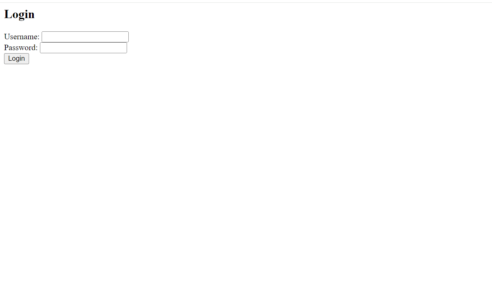

# LoginApp

- This project was created for the purpose of creating Login App and learning Angular as a starter.

## How to clone this repository?

* These steps will help you to clone the project to your computer.

### Project Cloning

* You can use the this command link for cloning the project files to your computer:

* git clone https://github.com/ipekyilmaz35/Simple-login-app-with-Angular

## Development server

* Run `ng serve` for a dev server. Then you can navigate to `http://localhost:4200/`. The application will automatically reload if you change any of the source files.

## Sample Screen Appearance
 

